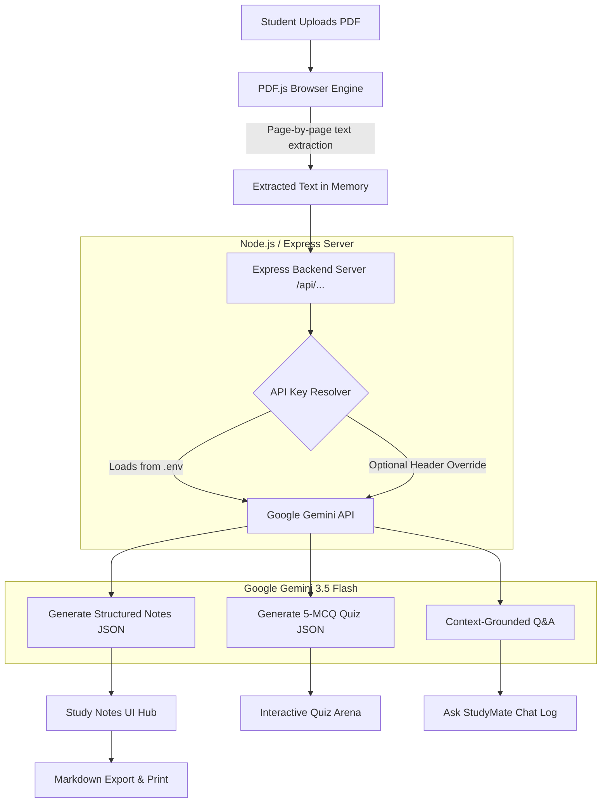

# StudyMate AI – AI Study Notes & Quiz Generator 🎓

> **Turn your study material into smart notes, exam questions, flash quizzes, and an AI tutor powered by Google Gemini and PDF.js.**


---

## 📌 Table of Contents
- [Project Description](#-project-description)
- [Problem Statement](#-problem-statement)
- [Key Objectives](#-key-objectives)
- [Key Features](#-key-features)
- [System Architecture & Workflow](#-system-architecture--workflow)
- [Technologies Used](#-technologies-used)
- [Project Structure](#-project-structure)
- [Getting Started & Installation](#-getting-started--installation)
- [Configuring the Gemini API Key](#-configuring-the-gemini-api-key)
- [How to Run Locally](#-how-to-run-locally)
- [Testing with Sample Materials](#-testing-with-sample-materials)
- [AI Prompt Engineering Design](#-ai-prompt-engineering-design)
- [Security & Best Practices](#-security--best-practices)
- [Future Enhancements](#-future-enhancements)
- [License](#-license)

---

## 📖 Project Description

**StudyMate AI** is a beginner-friendly, full-stack Generative AI web application created to help students, researchers, and lifelong learners study faster and more effectively. 

Students can upload any textbook chapter, syllabus unit, research paper, or lecture slides in PDF format. Using client-side **PDF.js**, the application extracts the document text directly in the browser and connects to the **Google Gemini API** (`gemini-2.5-flash`) via a lightweight Node.js/Express backend. StudyMate generates structured study summaries, key points, terminology glossaries, mark-weighted exam questions, 5-question multiple-choice practice quizzes, and an interactive grounded Q&A tutor.

---

## ❓ Problem Statement

Students frequently encounter overwhelming quantities of unstructured study material (100+ page PDFs, dense slides, complex textbook chapters) before exams:
1. **Time-consuming Manual Summaries:** Creating concise study sheets by hand takes hours of repetitive work.
2. **Lack of Practice Exam Questions:** Students rarely know how professors will structure short-answer (2-mark), analytical (5-mark), or long-answer (10-mark) questions from textbook passages.
3. **Passive Reading vs. Active Recall:** Simply re-reading documents leads to low retention; students need immediate active-recall quizzes.
4. **Unanswered Clarifications:** When stuck on complex technical jargon, students need context-aware instant tutoring without losing their place.

---

## 🎯 Key Objectives

* **Zero Complex ML / Pure Generative AI:** Avoid traditional, heavyweight ML model training or Python dependencies; leverage state-of-the-art Generative AI through modern API prompt engineering.
* **Client-Side Document Parsing:** Process multi-page PDFs instantly using **PDF.js** without requiring server-side OCR daemons.
* **Structured Output Guarantees:** Ensure all AI responses follow strict JSON schemas for dependable UI rendering.
* **API Key Security:** Isolate secret API credentials on a lightweight backend rather than exposing them in client-side bundles.
* **Beginner-Friendly Architecture:** Clean, readable Vanilla JavaScript and HTML5/CSS3 with detailed comments throughout.

---

## ✨ Key Features

### 1. 📄 Client-Side PDF Upload & Text Extraction
* Drag-and-drop zone or file picker for `.pdf` files.
* Extracts multi-page text progressively in real time using **PDF.js**.
* Displays file statistics: file size, page count, word count, and estimated reading time.
* Built-in Raw Text Inspector modal to verify extracted text.

### 2. 📝 Structured AI Study Notes
* **Simple Summary:** Clear, student-friendly 2–3 paragraph overview explaining the core subject without jargon.
* **Key Points:** 5–8 high-impact bulleted concepts with card hover effects.
* **Definitions & Glossary:** Interactive searchable cards defining technical terms and formulas.
* **Important Exam Questions Hub:**
  * **5 Two-Mark Questions:** Quick definitions and basic conceptual tests.
  * **5 Five-Mark Questions:** Analytical questions (e.g., comparing algorithms, step-by-step processes).
  * **3 Ten-Mark Questions:** In-depth architectural evaluations and comprehensive essay outlines.
  * *Expandable accordions with model answers and scoring guides.*
* **Quick Revision Cram Sheet:** High-yield highlight points designed for last-minute review.

### 3. 🧪 Interactive Practice Quiz Arena
* Generates 5 Multiple-Choice Questions (MCQs) directly from the uploaded text.
* Interactive 4-option cards (A, B, C, D) with single-click answering.
* **Instant visual feedback:** Emerald green highlight for correct options, crimson red for incorrect selections.
* Immediate animated explanation box explaining *why* the answer is correct.
* Live score counter and celebratory completion verdict badge (with Retake option).

### 4. 💬 Grounded "Ask StudyMate" AI Tutor
* Interactive conversational assistant that answers student questions based strictly on the uploaded document.
* Preset quick-prompt chips (*"Explain with real-world analogy"*, *"Key comparisons"*, *"Top exam topics"*).
* Formats responses in rich Markdown (bolding, code blocks, lists) rendered with `marked.js`.

### 5. 📥 Export & Print Capabilities
* **Download as Markdown (`.md`):** Complete structured study guide file saved locally.
* **Print / Save as PDF:** Tailored print stylesheet for clean, distraction-free hard copies.
* **Copy All / Copy Section:** One-click clipboard copy buttons with toast notifications.

---

## 🏗️ System Architecture & Workflow



---

## 💻 Technologies Used

| Layer | Technology | Purpose |
| :--- | :--- | :--- |
| **Frontend UI** | HTML5, CSS3, Vanilla JS (ES6+) | Clean, responsive, glassmorphic student-friendly interface |
| **PDF Extraction** | [PDF.js](https://mozilla.github.io/pdf.js/) (v3.11 CDN) | Extracting textual content page-by-page in the browser |
| **Markdown Parser**| [Marked.js](https://marked.js.org/) (CDN) | Parsing AI formatted Markdown into HTML |
| **Backend Server** | Node.js, Express.js | API gateway, CORS handling, and environment isolation |
| **Generative AI**  | [@google/generative-ai](https://www.npmjs.com/package/@google/generative-ai) | Official Google SDK for Gemini 3.5 Flash |
| **Config / Security**| `dotenv` | Secure `.env` environment variable management |

---

## 📂 Project Structure

```
StudyMate-AI/
├── index.html                  # Main UI layout, upload dropzone, tabs & modals
├── style.css                   # Modern design system (glassmorphism, animations, print CSS)
├── script.js                   # Frontend controller (PDF.js, quiz engine, chat, API fetch)
├── package.json                # Project dependencies & launch scripts
├── .env.example                # Template for Gemini API key configuration
├── .gitignore                  # Prevents committing node_modules & .env
├── README.md                   # Full documentation & setup guide
├── server/
│   └── server.js               # Express API gateway connecting to Gemini API
└── sample-materials/
    └── sample-study-material.pdf # Ready-to-use sample PDF for testing
```

---

## 🚀 Getting Started & Installation

### Prerequisites
* [Node.js](https://nodejs.org/) installed (v18.0.0 or higher recommended).
* A free **Gemini API Key** from [Google AI Studio](https://aistudio.google.com/app/apikey).

### 1. Clone or Open the Project
Navigate to your project directory:
```bash
cd "AI study notes generator"
```

### 2. Install Node Dependencies
Run the install command:
```bash
npm install
```
*(On Windows PowerShell, if scripts are restricted, you can use `npm.cmd install`)*

---

## 🔑 Configuring the Gemini API Key

### Option A: Server Environment File (Recommended)
1. In the root directory, create a `.env` file by copying `.env.example`:
   ```bash
   cp .env.example .env
   ```
2. Open `.env` and paste your Gemini API key:
   ```env
   GEMINI_API_KEY=AIzaSyYourActualKeyHere12345
   PORT=3000
   ```

### Option B: Runtime Settings in UI
You can also click the **Settings (⚙️)** button in the top-right header of the web page and enter your key directly. It will be stored in your local browser session and sent securely to the local server via headers.

> [!TIP]
> Get a free API key at **[Google AI Studio](https://aistudio.google.com/app/apikey)**. The free tier offers 15 Requests Per Minute (RPM), which is more than enough for student use.

---

## 🏃 How to Run Locally

Start the Express application:
```bash
npm start
```
*(Or use `npm run dev` for auto-restart on code changes).*

Open your browser and navigate to:
```
http://localhost:3000
```

---

## 🧪 Testing with Sample Materials

You can test the application in two ways:

1. **One-Click Instant Sample:**
   * On the home screen, click **"⚡ Load Sample: Operating Systems & GFS"**.
   * Click **"Generate Study Notes"** or switch to the **"Practice Quiz"** tab to test immediately!
2. **Uploading the Included Sample PDF:**
   * Drag and drop `sample-materials/sample-study-material.pdf` into the upload box.
   * Watch PDF.js extract the pages in real time.
   * Click **"Generate Study Notes"**.

---

## 🧠 AI Prompt Engineering Design

### 1. Study Notes Generation Prompt
```text
You are StudyMate AI, an expert academic tutor.
Analyze the provided study material and return strictly valid JSON matching this schema:
{
  "topic": "Main topic title",
  "summary": "Clear, student-friendly 2-3 paragraph explanation",
  "keyPoints": ["Takeaway 1", "Takeaway 2", ...],
  "definitions": [{"term": "Term", "explanation": "Simple explanation"}],
  "examQuestions": {
    "twoMark": [{"question": "...", "answer": "..."}],   // 5 questions
    "fiveMark": [{"question": "...", "answer": "..."}],  // 5 questions
    "tenMark": [{"question": "...", "answer": "..."}]    // 3 questions
  },
  "quickRevision": ["High yield bullet 1", ...]
}
```

### 2. Practice Quiz Generation Prompt
```text
Generate exactly 5 multiple-choice questions (MCQs) to test conceptual understanding:
{
  "quizTitle": "Subject Practice Quiz",
  "questions": [
    {
      "id": 1,
      "question": "Question text?",
      "options": ["A) ...", "B) ...", "C) ...", "D) ..."],
      "correctAnswerIndex": 0,
      "explanation": "Why this option is correct."
    }
  ]
}
```

### 3. Ask StudyMate Q&A Prompt
```text
You are StudyMate AI, a patient tutor. Answer the student's question based strictly 
and primarily on the uploaded material provided. If outside the scope, mention this 
and give a helpful explanation. Format response cleanly using Markdown.
```

---

## 🔒 Security & Best Practices

* **No Leaked Keys:** The frontend never embeds or exposes the `GEMINI_API_KEY`.
* **`.gitignore` Protected:** `.env` and `node_modules` are excluded from version control.
* **Payload Sanitation:** File uploads and extracted text sizes are validated before dispatching API requests to prevent memory overflows.

---

## 🔮 Future Enhancements

* 🎙️ **Text-to-Speech Audio Notes:** Listen to summaries as audio podcasts on the go.
* 🗂️ **Interactive Flashcards:** Flip cards with spaced repetition algorithms.
* 🌐 **Multi-Language Translation:** Translate generated study notes into Spanish, Hindi, French, or German.
* 📊 **Export to Notion & Anki:** Direct `.apkg` flashcard and Notion page exports.

---

## 📄 License
This project is open-source under the **MIT License**. Feel free to customize and expand it for your university projects, study groups, or personal learning!
